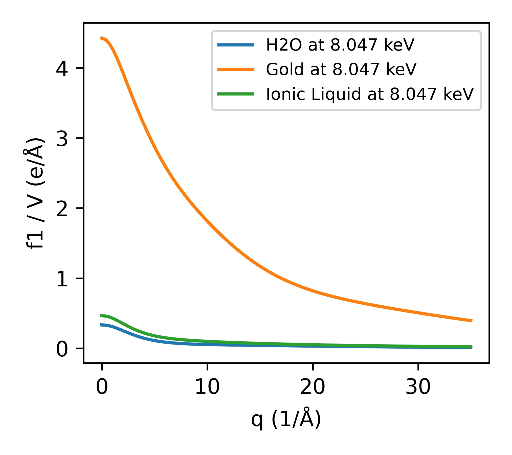

pyDABAX
=======


pyDABAX aims to make the dabax database fast and easy accessible in python. Besides the access to the original
database, pyDABAX also provides high level functionality for important quantities like anomalous x-ray and neutron
form-factors, absorption edges, and compton scattering.


Installation
===========
Package
-------------------
Install with pip into your current environment.

```bash
pip install pyDABAX
```

The following dependencies will be installed by pip:

-  `numpy <https://www.numpy.org/>`
-  `TinyDB <https://github.com/msiemens/tinydb>`
-  `astropy <https://github.com/astropy/astropy>`

Manual installation
----------------------
Clone the current git repository:

```bash
# Run in your terminal or conda terminal
git clone https://github.com/JulianMars/pyDABAX.git
```

We recommend using environments. Create and activate the environment.
You can install pyDABAX from inside the git folder to your current environment using:

```bash
# Install package using pip
cd ./pyDABAX.git           # Change into the pyDABAX.git folder
pip install .              # Use the pip package manager to install pyDABAX in your current python environment
```


Usage
=====

High-level interface
--------------------

Getting Started 
_____  

Create compound from string with fixed energy.
```python
from pydabax.elements import Compound
Gold = Compound('Au', energy='10 keV', density='19.3 g/cm^3')
```

Obtain refractive index, x-ray form factor, and attenuation coefficient.
```python
print('Refractive index: δ + βi = {:.3e} + {:.3e}i'.format(Gold.deltabeta.real, Gold.deltabeta.imag))
print('Formfactor: f = {:.3f} + {:.3f}i (e/atom)'.format(Gold.f.real, Gold.f.imag))
print('Attenuation coefficient: mu = {:.3f} (1/cm)'.format(Gold.mu.value))
```
> Refractive index: δ + βi = 2.987e-05 + 2.205e-06i  
> Formfactor: f = 73.419 + 5.421i (e/atom)  
> Attenuation coefficient: mu = 2218.580 (1/cm)


Plot the q-dependent Form factor:
```python
import matplotlib.pyplot as plt
import numpy as np
from pydabax.elements import Compound

#q-space
q = np.linspace(0, 35, 101)
#Create Compounds
Gold = Compound("Au", energy="8.047 keV", density="19.3 g/cm^3")
Water = Compound("H2O", energy="8047 eV", density="997 kg/m^3")
#Set q of compounds
Water.q = q
Gold.q = q
#Prepare plot
fig, ax = plt.subplots(figsize=[3.375, 3])
ax.set_xlabel("q (1/Å)")
ax.set_ylabel("f1 (e/atom)")
#Obtain f from compounds and plot
ax.plot(Water.q, Water.f.real, label="H2O at 8.047 keV")
ax.plot(Gold.q, Gold.f.real, label="Gold at 8.047 keV")
_ = ax.legend(prop={"size": 8})
```



Units
_____
As the different flavors of x-ray analysis prefers different units, pyDABAX uses astropy to handle physical quantities
consisting of a value and a unit. Hence, unit handling should be flexible and coherent within the package.
First, set the preferred global units. Standard units are keV, Å, 1/Å, and °.
All inputs without explicitly specified unit and all outputs will have this unit.

```python
#Photon energy
UnitSettings.UNIT_E = 'eV'
#Momentum transfer
UnitSettings.UNIT_Q = '1/nm'
#Wavelength
UnitSettings.UNIT_R = 'nm'
#Total scattering angles
UnitSettings.UNIT_TTH = 'rad'
```

Accessing the X-ray database dabax
---------------------------------

Show all available entries for oxygen.
```python
from pydabax.dabax import dabax as dbx
dbx.get_keys("C")
```
>['atomic_number',
 'symbol',
 'name',
 'charge',
 'atomic_weight',
 'nist_f1f2_chantler',
 'nist_edges_chantler',
 'cxro_f1f2_henke',
 'nist_b_sears',
 'dabax_atomic_densities',
 'dabax_atomic_constants',
 'dabax_crosssec_mcmaster',
 'dabax_crosssec_compton_mcmaster',
 'dabax_ebind_1',
 'dabax_crosssec_brennancowan',
 'dabax_crosssec_xcom',
 'dabax_f1f1_brennancowan_long',
 'dabax_f1f1_brennancowan',
 'dabax_f0_waaskirf',
 'dabax_isf_balyuzi',
 'dabax_f1f2_chantler',
 'dabax_f1f2_henke']

Get the CXRO Henke table for f1 and f2.
```python
from pydabax.dabax import dabax as dbx
dbx.get_table("C", "cxro_f1f2_henke")
```


>E (eV)	f1	f2  
0	10.0000	-9999.00000	0.703280  
1	10.1617	-9999.00000	0.707226  
2	10.3261	-9999.00000	0.707377  
3	10.4931	-9999.00000	0.707528  
4	10.6628	-9999.00000	0.707678  
...	...	...	...  
497	28135.1000	8.00267	0.002087  
498	28590.2000	8.00248	0.002013  
499	29052.6000	8.00230	0.001942  
500	29522.5000	8.00212	0.001874  
501	30000.0000	8.00194	0.001808  
502 rows × 3 columns  


The database file is in json format and can be thus viewed with all common json viewers.
Jupyter lab comes with an integrated json viewer.  